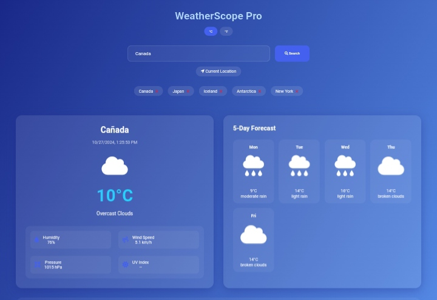

# WeatherScope Pro

WeatherScope Pro is a user-friendly weather application that provides real-time weather updates, forecasts, and air quality information based on user input or current location. 



## Features

- **Real-Time Weather Data**: Get current weather updates based on city names or coordinates.
- **5-Day Forecast**: View detailed weather forecasts for the next five days.
- **Air Quality Index**: Monitor the air quality in your area with real-time AQI data.
- **Unit Toggle**: Switch between Celsius and Fahrenheit for temperature readings.
- **Dynamic Backgrounds**: Backgrounds that change according to weather conditions.
- **Saved Locations**: Save your favorite locations for quick access to weather updates.

- HTML
- CSS
- JavaScript
- Font Awesome (for icons)
- [Animate.css](https://animate.style/) (for animations)

## Installation

To run WeatherScope Pro locally:

1. Clone this repository:

   ```bash
   git clone https://github.com/JohnDev19/WeatherScope.git
   cd WeatherScope
   ```

2. Open the `index.html` file in your web browser.

## Usage

1. Enter a city name or coordinates in the search input field.
2. Click the **Search** button or use the **Current Location** option to get the weather details.
3. Switch between Celsius and Fahrenheit using the unit toggle buttons.
4. Save your favorite locations for easy access later.

## Contribution

Contributions are welcome! If you have suggestions for improvements or new features, feel free to fork the repository and submit a pull request.

## License

This project is licensed under the MIT License. See the [LICENSE](LICENSE) file for more details.

## Acknowledgments

- [OpenWeatherMap API](https://openweathermap.org/api) for weather data.
- Font Awesome for icons.
- Animate.css for animation effects.
